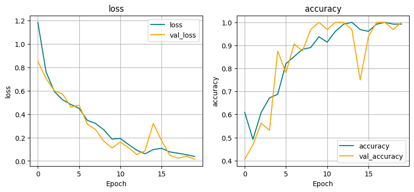

# Image Classification Happy and Sad Expression

## Project Overview
In this project, I have crafted a machine learning model designed to classify images and determine whether a face is expressing happiness or sadness.

## Project Objectives
- **Image Classification**: Create a robust machine learning model capable of accurately classifying facial expressions in images as either happy or sad.
- **Model Accuracy**: Achieve a high level of accuracy in the classification task, ensuring reliable and precise predictions.

## Dataset
The dataset utilized in this project is derived from images obtained through web scraping on Google Images, specifically focusing on images portraying happy and sad facial expressions. The dataset is organized within a directory named `data`. Within the `data` directory, the images are further categorized into two subdirectories: `happy` and `sad`. The `happy` directory contains a total of 121 images depicting happy expressions, while the `sad` directory comprises 69 images capturing sad expressions.

## Data Preprocessing
The data preprocessing steps implemented in this project encompass the following procedures:
- **Remove Dodgy Images:** Exclude images with file extensions other than .jpg, .jpeg, .png, and .bmp.
- **Resize:** Standardize the dimensions of the images by resizing them to a uniform size of 256x256 pixels.
- **Normalize:** Transform the pixel values of the images to a scale ranging from 0 to 1. This is achieved by dividing each pixel element by 255.

## Model
### Architecture
The CNN consists of 3 convolutional layers and 3 max pooling layers. Each convolutional layer uses a 3x3 kernel with stride of 1 and activation function 'relu' to extract features from the input image. The max pooling layers use a 2x2 kernel with stride of 2 to downsample the feature maps. The last convolutional layer is followed by a flatten layer to convert the 3D feature maps into a 1D feature vector. The flattened output is then passed through 2 dense layers with activation function 'relu' and 'sigmoid' respectively, to produce a binary classification output.

### Input Shape
The input shape of the network is (256, 256, 3), which means that the input image is of size 256x256 pixels and has 3 channels (RGB).

### Parameters
The first convolutional layer has 16 filters, the second convolutional layer has 32 filters, and the third convolutional layer has 16 filters. The number of filters determine the number of feature maps produced by each layer. The dense layers have 256 and 1 units respectively.

## Training and Evaluation
The model undergoes training employing the Adam optimizer and binary cross-entropy loss function. The training process spans 20 epochs, during which the model is exposed to both training and validation datasets. The training and validation loss curves, as well as accuracy metrics, are visualized in the accompanying plot.

Based on the model's performance on the validation dataset, an impressive accuracy of 100% is achieved, accompanied by a loss value of 0.

Subsequently, the model undergoes evaluation using the test dataset, wherein batches of images are processed to obtain predictions. The evaluation metrics include accuracy, precision, recall, and F1-score, all of which showcase a consistent accuracy of 100%.

To further illustrate the model's functionality, a sample inference is conducted using a single image. The image undergoes resizing and normalization before the model predicts its class (happy or sad) based on a threshold of 0.5. This exemplifies the model's capability to make accurate predictions on individual images.
